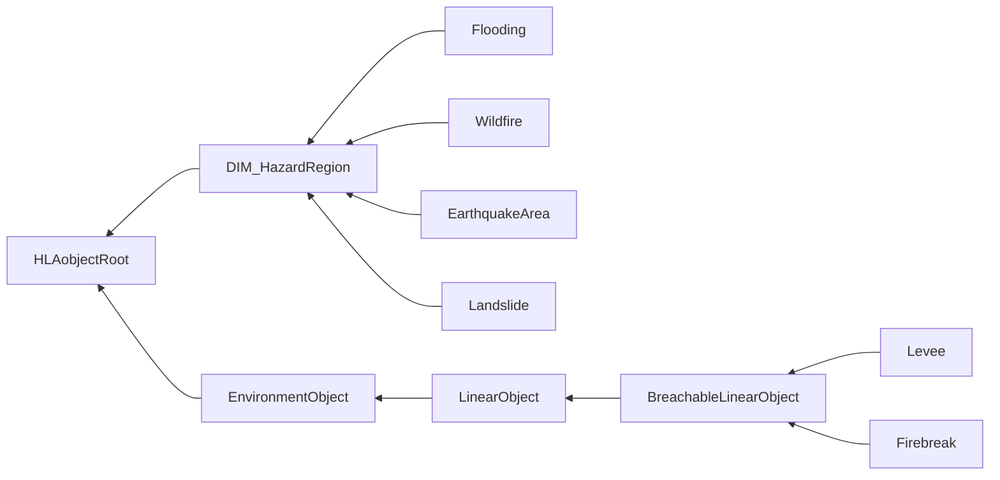
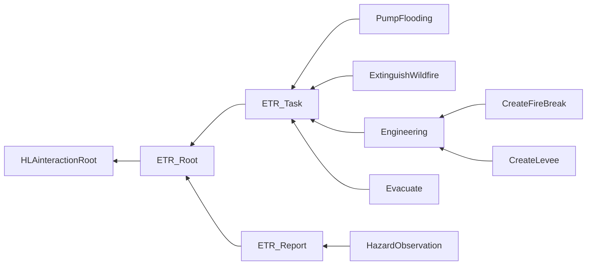

# NETN-DIM
|Version| Date| Dependencies|
|---|---|---|
|1.0|2023-04-01|RPR-SE, NETN-ETR|

The NATO Education and Training Network (NETN) Disaster Module (DIM) provides a common standard interface for representing hazards, e.g. flooding and wildfire, in federated distributed simulation environments.

Hazards such as wildfire, flooding, earthquakes and landslides cause different effects in a synthetic environment and to the simulated entities. Furthermore, hazard observation reporting and activities to mitigate the effect of hazards are important aspects of simulations where hazards are part of the scenario.
        
The NATO Education and Training Network Disaster Module (NETN-DIM) is a specification of how to model hazards and control activities to mitigate their effects, in a federated distributed simulation. 
The specification is based on IEEE 1516 High Level Architecture (HLA) Object Model Template (OMT) and is primarily intended to support interoperability in a federated simulation (federation) based on HLA. A Federation Object Model (FOM) Module is used to specify how data is represented and exchanged in the federation. The NETN-DIM FOM module is available as an XML file for use in HLA-based federations.

## Object Classes

Note that inherited and dependency attributes are not included in the description of object classes.

### DIM_HazardRegion

The geographical region of a hazard in a synthetic environment.

|Attribute|Datatype|Semantics|
|---|---|---|
|Time|ScenarioTime|Time at which the hazard region was first created.|
|Area|LocationStructArray|Required: Geographical boundary of the HazardRegion.|

### Flooding

Representation of a flooded area.

|Attribute|Datatype|Semantics|
|---|---|---|
|Level|MeterFloat32|Required: FloodingLevel represents the water level of the flooding relative to Mean Sea Level (MSL).|
|LevelChange|LevelChangeMeterPerSecondFloat32|Optional: FloodingLevelChange represents the change of the water level over time. An observer thus can determine if the flood level is going to rise (and further actions/precautions may be necessary) or if the water is draining and thus recovery measure can start soon.|

### Wildfire

Representation of a wildfire that may spread.

|Attribute|Datatype|Semantics|
|---|---|---|
|FrontWidth|MeterFloat32|Required: FrontWidth indicates the thickness of the actual fire ring surrounding a no longer burning region. It is assumed that a fire start at one or more spots and then spreads in a circular shape with a fire front of certain thickness and burnt land behind the front line. The Area attribute from DiM_HazardRegion defines the outer boundary of the overall region, the front of flames in the denoted thickness is assumed to extend from inside the boundary into the region.|
|FrontVelocity|VelocityMeterPerSecondFloat32|Optional: FrontVelocity denotes the spread velocity of the front line. Thus, an observer can estimate when the fire will hit a certain location. The actual boundary and the velocity hereby have the same relationship as position and velocity of a physical entity, although here in a simplifying assumption only one single speed of spreading is assumed to hold. Default = 0.|
|Temperature|TemperatureDegreeCelsiusFloat32|Optional: Temperature, based on SI derived unit degree Celsius, unit symbol °C.|

### EarthquakeArea

An area affected by an earthquake.

|Attribute|Datatype|Semantics|
|---|---|---|
|Magnitude|RichterScale|Required: Richter magnitude scale.|

### Landslide

Representation of a landslide area covered by mud, snow or gravel.

|Attribute|Datatype|Semantics|
|---|---|---|
|Thickness|MeterFloat32|Required: Thickness in meter.|
|LandslideType|LandslideTypeEnum|Optional: The type of landslide material. Default = 0.|

### Levee

A levee is a wall/separator that protects an area from flooding.

### Firebreak

A firebreak is a corridor without any burning things. The firebreak should separate the burning part from the not burning part.

## Interaction Classes

Note that inherited and dependency parameters are not included in the description of interaction classes.

### PumpFlooding

Task an entity to start pumping water out of an area.

|Parameter|Datatype|Semantics|
|---|---|---|
|FloodingId|UUID|Required: Reference to a Flooding object.|
|Duration|TimeMillisecondInt64|Optional: The duration of the pumping task. Default if not provided pumping shall continue until explicit task cancel or beginning of next task.|

### ExtinguishWildfire

Task an entity to extinguish a wildfire.

|Parameter|Datatype|Semantics|
|---|---|---|
|WildfireId|UUID|Required: A reference to a Wildfire object.|

### CreateFireBreak

Task for building up a firebreak.

### CreateLevee

Task for building up a levee.

### Evacuate

A request for evacuation

|Parameter|Datatype|Semantics|
|---|---|---|
|Area|LocationStructArray|Required: The geographical area in which evacuation takes place.|
|EntityType|EntityTypeStruct|Required: Type of entity. Based on the Entity Type record as specified in IEEE 1278.1-1995 section 5.2.16.|
|Amount|QuantityInt32|Optional: How many persons / things to evacuate. Default = All.|

### HazardObservation

Observation of a dangerous area.

|Parameter|Datatype|Semantics|
|---|---|---|
|Area|LocationStructArray|Required: The estimated area affected by the hazard.|
|HazardType|HazardTypeEnum|Required: The type of hazard obeserved.|

## Datatypes

Note that only datatypes defined in this FOM Module are listed below. Please refer to FOM Modules on which this module depends for other referenced datatypes.

### Overview
|Name|Semantics|
|---|---|
|HazardTypeEnum|Different types of hazards.|
|LandslideTypeEnum|The type of landslide material.|
|LevelChangeMeterPerSecondFloat32|Change of the water level over time.|
|RichterScale|Richter magnitude is measured in energy (ergs): M=log10 (A/A0), where A=amplitude on a seismograph, and A0=1/1,000 millimeters. Each increase of 1 in Richter magnitude represents a 31-fold increase in the amount of released energy.|
        
### Simple Datatypes
|Name|Units|Semantics|
|---|---|---|
|LevelChangeMeterPerSecondFloat32|meter per second (m/s)|Change of the water level over time.|
|RichterScale|ergs|Richter magnitude is measured in energy (ergs): M=log10 (A/A0), where A=amplitude on a seismograph, and A0=1/1,000 millimeters. Each increase of 1 in Richter magnitude represents a 31-fold increase in the amount of released energy.|
        
### Enumerated Datatypes
|Name|Representation|Semantics|
|---|---|---|
|HazardTypeEnum|HLAinteger16BE|Different types of hazards.|
|LandslideTypeEnum|HLAinteger16BE|The type of landslide material.|
    